# Scalina

The website for **Scalina**, an Australian studio with two teams under one roof:
**Scalina Media** makes the content that gets a business found, and **Scalina
Systems** builds the software it runs on.

Built with Next.js 16 (App Router), TypeScript and CSS Modules. Motion is GSAP +
ScrollTrigger, Lenis smooth scrolling on GSAP's ticker, and motion.dev for
micro-interactions.

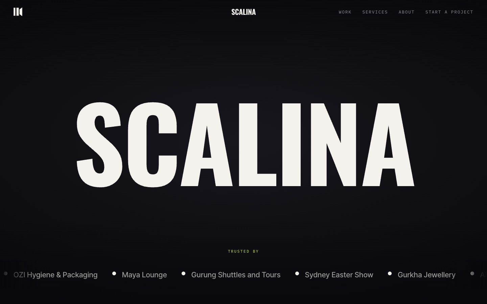

---

## A look around

### Homepage

| Software we've shipped | Latest work |
|---|---|
| 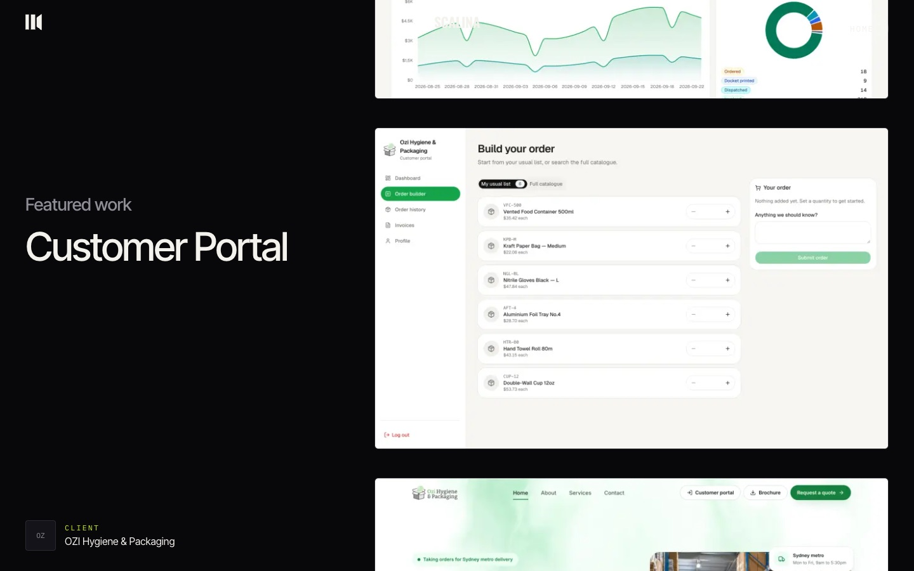 | 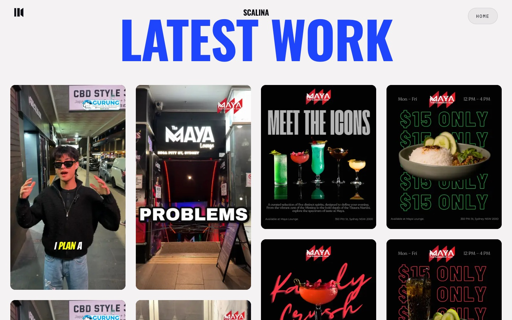 |

### Work: one case study per client

A minimal index (hover a row for a cursor-following preview), then a full case
study for each client: the brief, results, one chapter per thing we made or
built, and finished videos that play with sound on tap.

| Case study index | Gurung Shuttles: lead flow |
|---|---|
| 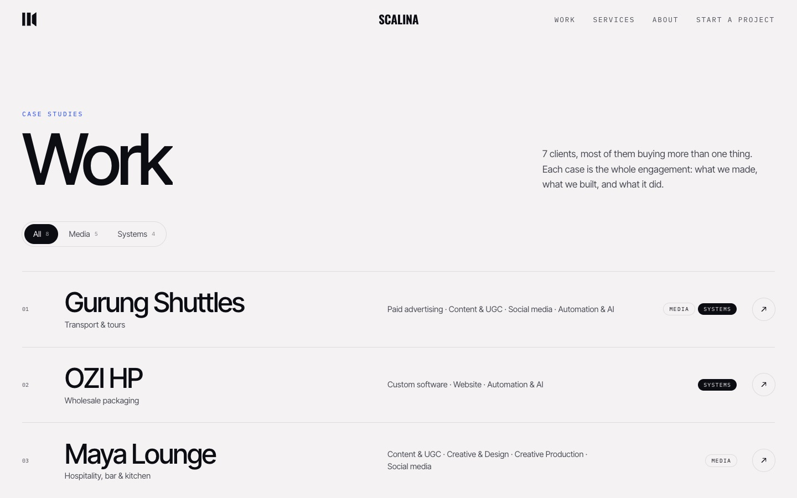 | 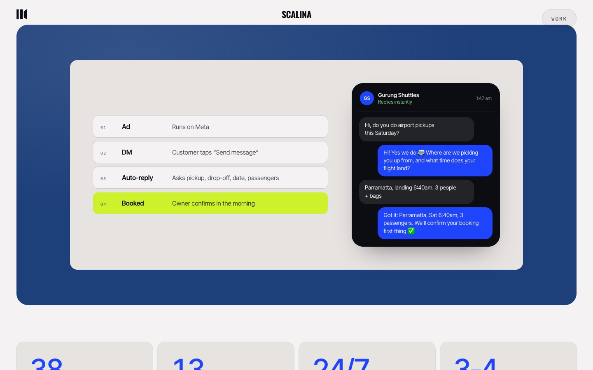 |

| Maya Lounge: weekly UGC | OZI HP: warehouse system |
|---|---|
| 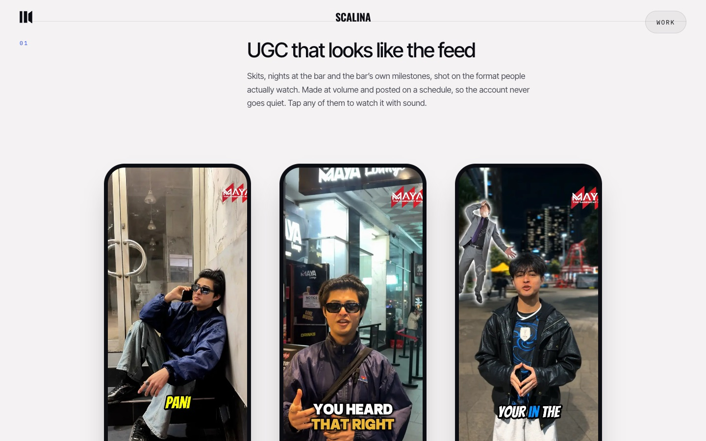 | 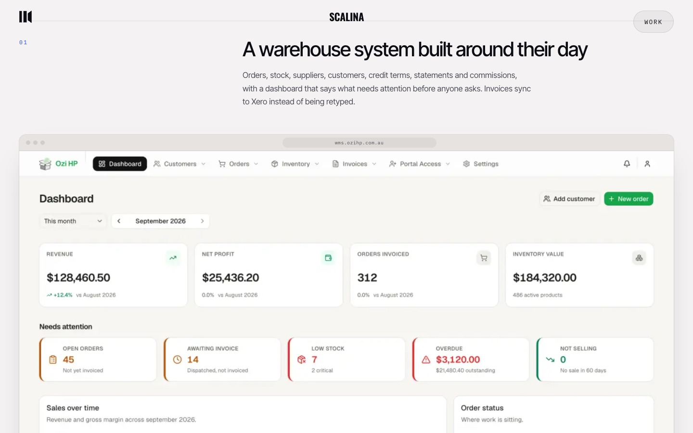 |

### About and Services

| About: proof bento | Services: Media |
|---|---|
| 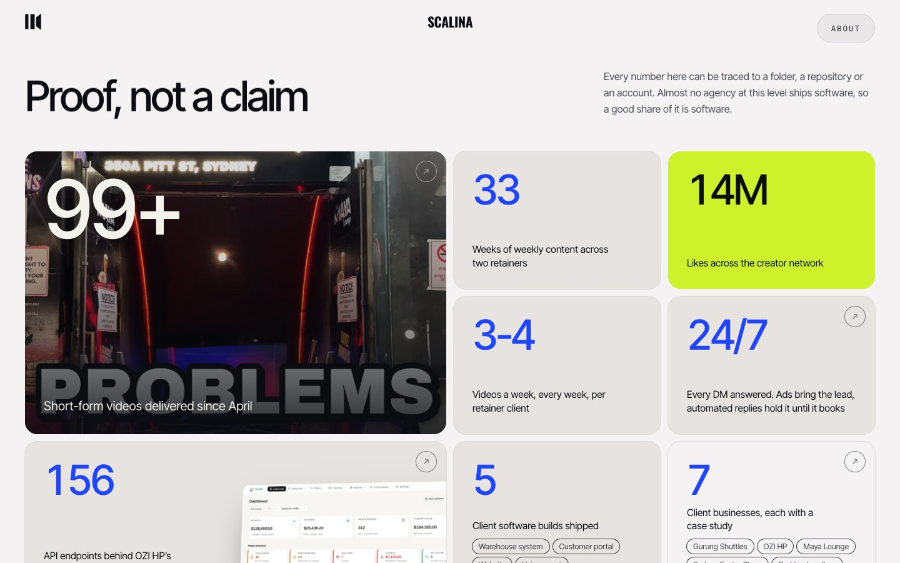 | 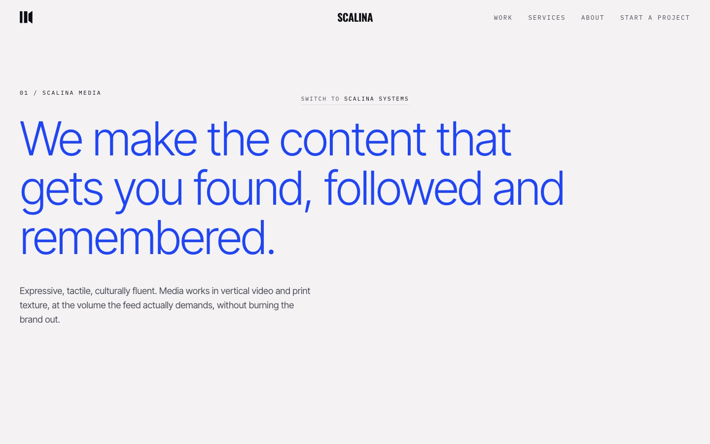 |

| Services: Systems figures | Start a project |
|---|---|
| 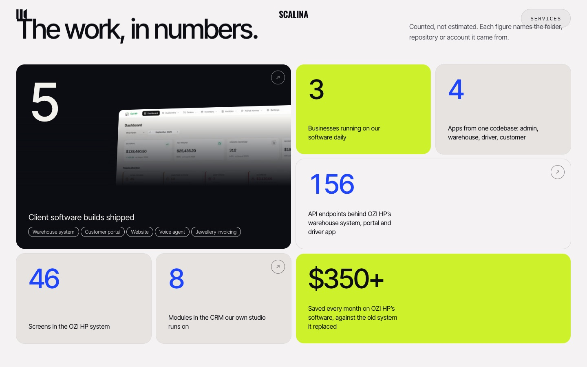 | 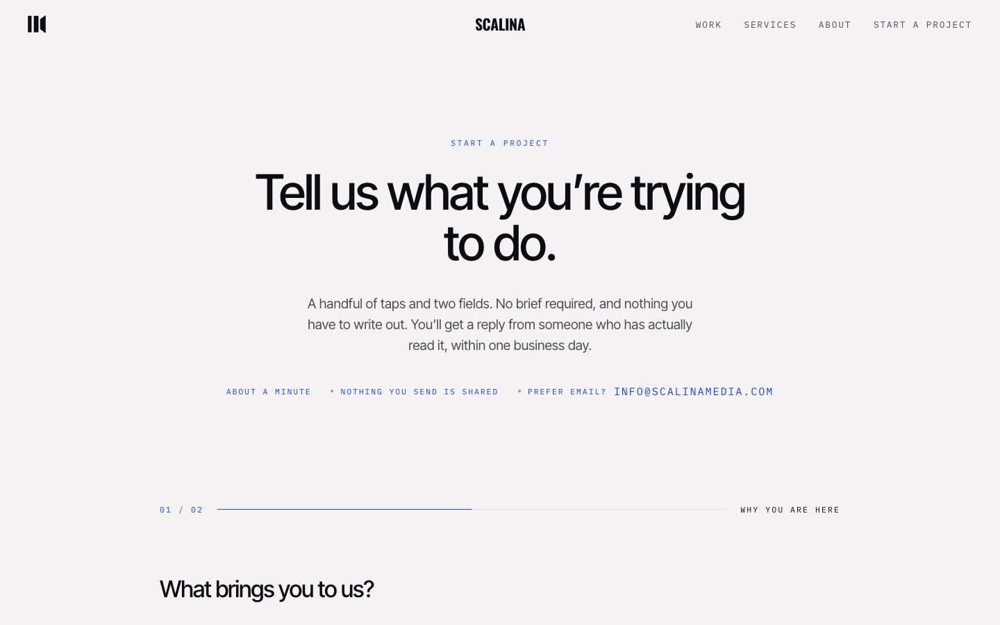 |

### Mobile

<p>
  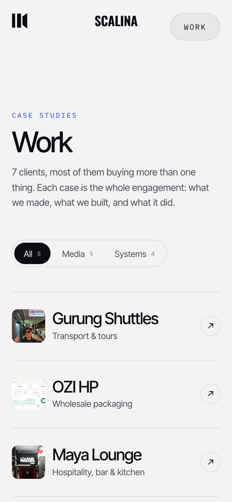
  &nbsp;
  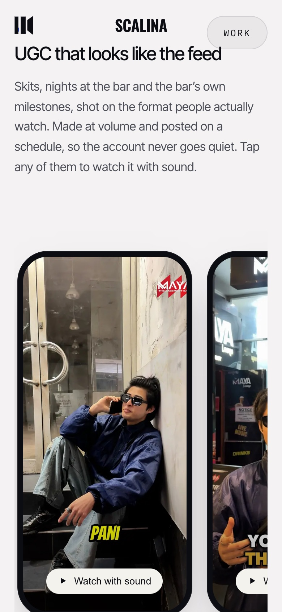
</p>

---

## Run it

```bash
npm install
npm run dev            # http://localhost:3000
npm run build && npm start
```

Checks to run before shipping:

```bash
npx tsc --noEmit
npm run lint
npm run test:contrast  # section-transition contrast never drops below 3:1
npm run test:scale     # spacing on the 2px grid, motion and label tokens only
```

Enquiries from `/start` are delivered to the Scalina CRM and by SMTP, configured
in `.env.local`. Until those variables are set, submissions return 502 on
purpose (see `lib/deliverEnquiry.ts`).

## Pages

| Route | What it is |
|---|---|
| `/` | Hero, the two teams, shipped software, what we do, the Scalina System, latest work, founder |
| `/work` | Case-study index, filterable by team |
| `/work/[slug]` | One case study per client, prerendered from `lib/work.ts` |
| `/services?view=media\|systems` | Each team's services, a service explorer and a figures bento |
| `/about` | The two teams, how we work (a pinned scroll story), proof bento, founder |
| `/start` | A short, mostly multiple-choice enquiry flow |

## Where things live

Content is kept out of components. To change what the site says, edit `lib/`.

| File | Holds |
|---|---|
| `lib/work.ts` | Every case study: copy, media, results (each with its source) |
| `lib/proof.ts` | The bento figures on About and Services |
| `lib/services.ts` | Services copy for both teams |
| `lib/content.ts` | Client list and CTA wording |
| `lib/enquiry.ts` | The enquiry questions and their closed vocabulary |
| `public/work/<client>/` | Case-study media: screenshots, posters, video loops and full edits |

Every figure on the site is counted, not estimated, and `lib/work.ts` /
`lib/proof.ts` record where each one came from. Software screenshots show the
real interfaces running against sample data. `scripts/media-capture/` explains
how they were made, so they can be re-shot when a client's software changes.

## Further reading

- `HANDOFF.md`: the running record of decisions, fixes and open questions
  (newest first). Read this before changing anything.
- `DESIGN.md`: colour, type, spacing and motion rules.
- `docs/ARCHITECTURE.md`: deeper notes on the ground-colour system and vendored
  components.
